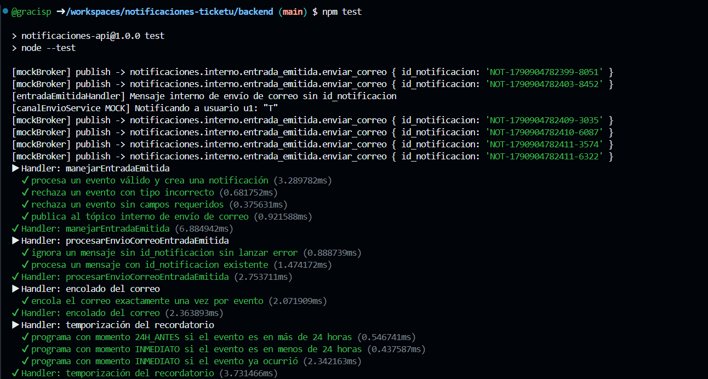
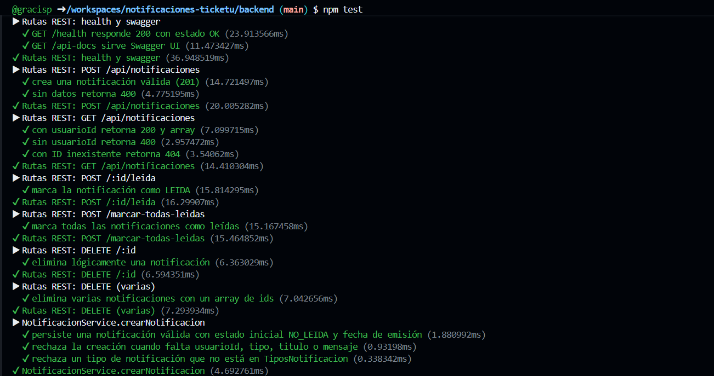
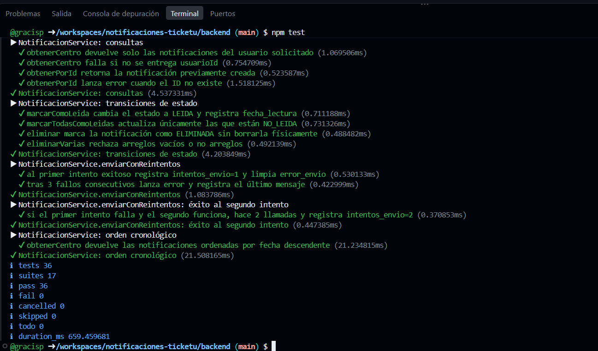

# Pruebas de Funcionalidad - Módulo Notificaciones

## Herramienta

- **Node.js** con el runner nativo `node --test` (Node 18+).
- **supertest** para las pruebas de rutas HTTP.
- Mocks en memoria para broker (RabbitMQ) y repositorio (sin Postgres).

## Cómo ejecutar

    cd backend
    npm test

O directamente:

    cd backend
    node --test test/

## Estructura

    backend/test/
        - service.test.js     (15 tests - lógica de negocio)
        - handler.test.js     (10 tests - handlers de eventos)
        - routes.test.js      (11 tests - rutas REST)
        - README.md           (este archivo)
        - evidencia/          (capturas de ejecución)

## Casos de prueba

### service.test.js - Lógica de negocio (15 tests)

| # | Descripción |
|---|-------------|
| 1 | Persiste una notificación válida con estado inicial NO_LEIDA |
| 2 | Rechaza creación sin campos obligatorios |
| 3 | Rechaza tipo inválido |
| 4 | obtenerCentro devuelve solo del usuario solicitado |
| 5 | obtenerCentro falla sin usuarioId |
| 6 | obtenerPorId retorna la notificación |
| 7 | obtenerPorId falla si no existe |
| 8 | marcarComoLeida cambia a LEIDA |
| 9 | marcarTodasComoLeidas actualiza solo NO_LEIDA |
| 10 | eliminar marca como ELIMINADA |
| 11 | eliminarVarias rechaza arreglos vacíos |
| 12 | enviarConReintentos éxito al primer intento |
| 13 | enviarConReintentos falla tras 3 intentos |
| 14 | enviarConReintentos: éxito al segundo intento (2 llamadas) |
| 15 | obtenerCentro devuelve ordenado por fecha descendente |

### handler.test.js - Handlers de eventos (10 tests)

| # | Descripción |
|---|-------------|
| 1 | Procesa evento entrada_emitida |
| 2 | Rechaza evento con tipo incorrecto |
| 3 | Rechaza evento sin campos requeridos |
| 4 | Publica al tópico interno de correo |
| 5 | Ignora mensaje sin id_notificacion |
| 6 | Procesa mensaje de envío válido |
| 7 | encola el correo exactamente 1 vez por evento |
| 8 | Recordatorio: momento 24H_ANTES si el evento es > 24h | 
| 9 | Recordatorio: momento INMEDIATO si el evento es < 24h |
| 10 | Recordatorio: momento INMEDIATO si el evento ya ocurrió |

### routes.test.js - Rutas REST (11 tests)

| # | Descripción |
|---|-------------|
| 1 | GET /health responde 200 |
| 2 | GET /api-docs sirve Swagger UI |
| 3 | POST /api/notificaciones crea (201) |
| 4 | POST sin datos retorna 400 |
| 5 | GET con usuarioId retorna array |
| 6 | GET sin usuarioId retorna 400 |
| 7 | GET con ID inexistente retorna 404 |
| 8 | POST /:id/leida marca como LEIDA |
| 9 | POST /marcar-todas-leidas |
| 10 | DELETE /:id elimina |
| 11 | DELETE con array de ids elimina varias |

**Total: 36 tests**

## Resultado esperado

    tests 36
    pass 36
    fail 0

## Evidencia de ejecución

Capturas de la ejecución de `npm test` con los 36 tests pasando.

Resultado: 36/36 pruebas de funcionalidad pasando.

## Observación sobre la temporización del recordatorio

La temporización (24h antes e inmediato) se verifica en `handler.test.js` mediante mock de `crearTrabajoRecordatorio`.
