# Pruebas de Integración en Postman - Módulo Notificaciones

## Herramienta

- **Postman Desktop** con colección y environment exportados.
- Se evalúa la **definición** de los servicios de integración.

## Estructura

        tests/postman/
            - coleccionNotificaciones.json  (Colección de requests con tests)
            - entornoNotificaciones.json    (Variables de entorno)
            - evidencias/                   (Capturas de la ejecución)
            - README.md                      (este archivo)

## Cómo importar

1. Abrir Postman Desktop.
2. Click en Import.
3. Arrastrar los 2 archivos .json:
    - entornoNotificaciones.json
    - coleccionNotificaciones.json
4. En la esquina superior derecha, seleccionar el enviroment "Entorno Notificaciones (dev)".

## Cómo ejecutar

1. Click derecho sobre la colección "Notificaciones - TicketU".
2. Seleccionar "Run collection".
3. Click en "Run Notificaciones - TicketU".
4. Postman ejecutará los 11 requests y mostrará los resultados.

## Casos de prueba

### 1. Servicios propios - 8 requests

| # | Request | Método | Resultado esperado |
|---|----------|--------|--------------------|
| 1.1 | /health | GET | 200, servicio=notificaciones, estado=OK |
| 1.2 | /api/notificaciones | POST | 201, id generado, estado NO_LEIDA |
| 1.3 | /api/notificaciones?usuarioId | GET | 200, array con al menos 1 notificación |
| 1.4 | /api/notificaciones/{id} | GET | 200, notificación correcta |
| 1.5 | /api/notificaciones/{id}/leida | POST | 200, estado LEIDA, fecha_lectura |
| 1.6 | /api/notificaciones/marcar-todas-leidas | POST | 200, array |
| 1.7 | /api/notificaciones/{id} | DELETE | 200, estado ELIMINADA |
| 1.8 | /api-docs/ | GET | 200, HTML de Swagger |

### 2. Invocaciones a otros módulos - 3 requests

| # | Request | Método | Resultado esperado |
|---|----------|--------|--------------------|
| 2.1 | {authUrl}/usuarios/{id} | GET  | Simulado. Definición documentada. |
| 2.2 | {entradasUrl}/eventos/{id} | GET | Simulado. Definición documentada. |
| 2.3 | {panelUrl}/eventos/{id}/estado | GET | Simulado. Definición documentada. |

Total: 11 casos de prueba, 23 tests

## Resultado final

- **11 requests** en la colección.
- **23 tests ejecutados** (3 tests por request principal + tests de definición).
- **23 tests pasados** (100%).
- **8 requests propios** ejecutados con respuestas 200/201.
- **3 requests simulados** con definición documentada (no se envían por apuntar a localhost, es lo esperado)

## Resumen del Runner de Postman

    All tests: 23
    Passed: 23
    Failed: 0
    Errors: 3 (conexión, esperados)

## Nota sobre los errores de conexión

En el resumen del Runner aparece  `Errors: 3`, esto corresponde a los requests de la sección 2 (2.1 Auth, 2.2 Entradas, 2.3 Panel) que no pueden enviarse porque las URLs (`authUrl`, `entradasUrl`, `panelUrl`) apuntan a `localhost`(servicios de otros equipos).

Esto es lo **esperado y por el momento correcto**, ya que se evalúa la **definición** de los servicios de integración y más adelante la **integración** de los servicios. Los tests automáticos de esos requests validan la **definición de la invocación** (que la URL contenga `/usuarios` o `/eventos/`), por lo que pasan correctamente aunque el request en sí no se envíe.

## Variables del entorno

| Variable | Valor por defecto | Descripción |
|----------|-------------------|-------------|
| baseUrl | https://studious-spoon-wjx679p4jg43gj5q-3000.app.github.dev | URL pública del módulo Notificaciones |
| authUrl | http://localhost:3001 | Placeholder para servicio de Auth |
| entradasUrl | http://localhost:3002 | Placeholder para servicio de Entradas |
| panelUrl | http://localhost:3003 | Placeholder para servicio del Panel |
| usuarioId | user-test-001 | Usuario de prueba |
| notificacionId | (vacío) | Se llena automáticamente al ejecutar los tests |

Observación: Las URLs authUrl, entradasUrl y panelUrl apuntan a localhost como placeholder, si se cuenta con las URLs reales de otros equipos, se pueden actualizar en el entorno.

## Evidencia de ejecución

Capturas de cada request ejecutado de Postman. Se encuentran en la carpeta `evidencias/`.

### 1. Servicios propios

**1.1 GET /health - Estado del servicio**
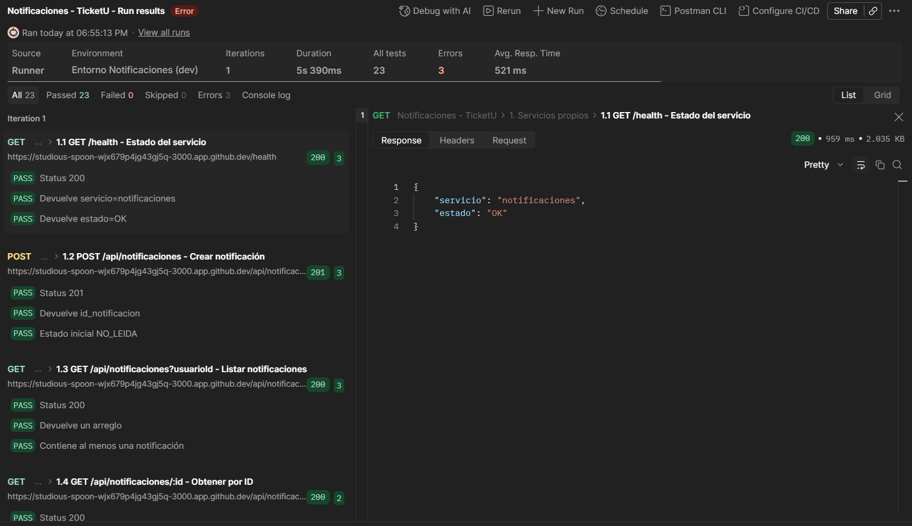

**1.2 POST /api/notificaciones - Crear notificación**
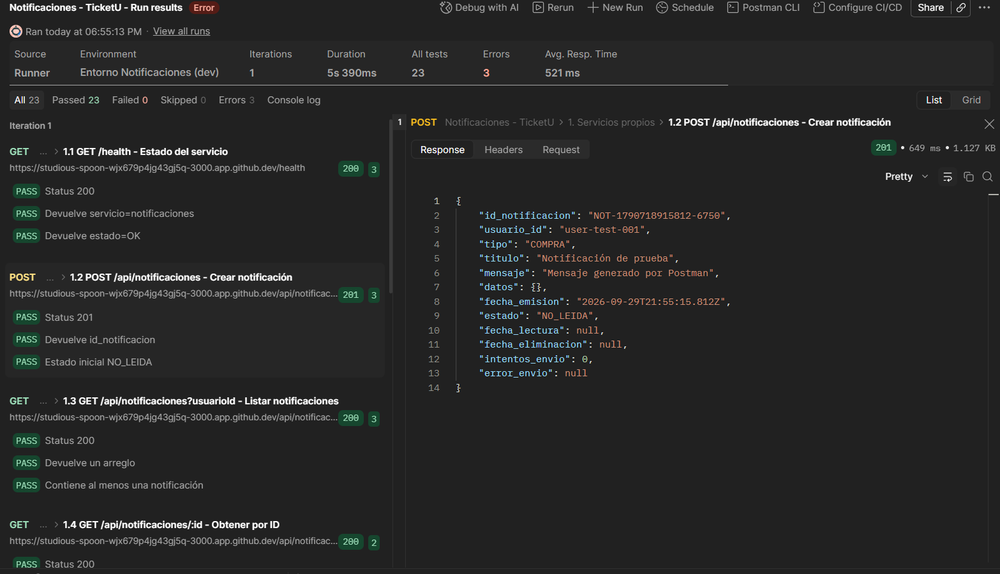

**1.3 GET /api/notificaciones - Listar notificaciones**
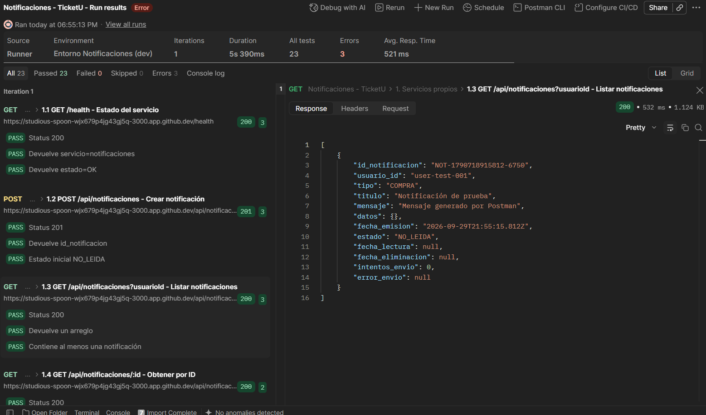

**1.4 GET /api/notificaciones/:id - Obtener por ID**
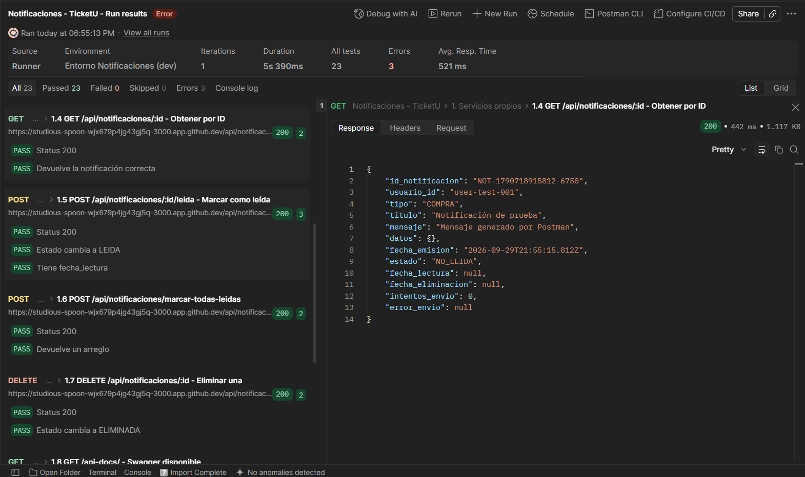

**1.5 POST /api/notificaciones/:id/leida - Marcar como leída**
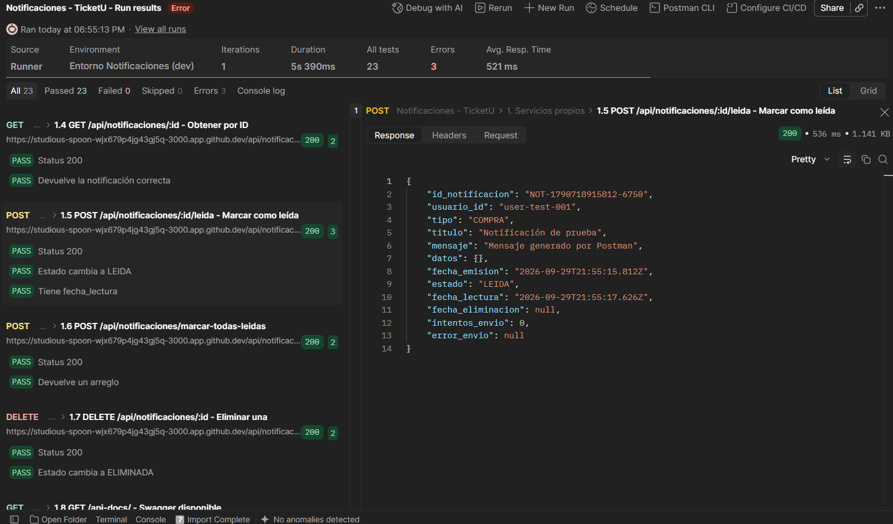

**1.6 POST /api/notificaciones/marcar-todas-leidas**
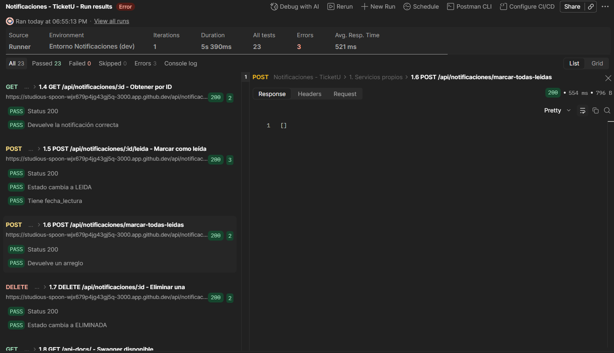

Observación: La respuesta es un array vacío `[]` porque en el paso anterior ya se marcó la única notificación como LEIDA, por lo que no había notificaciones marcadas como NO_LEIDA pendientes de actualizar, por lo que el test pasa correctamente verificando Status 200 y tipo array.

**1.7 DELETE /api/notificaciones/:id - Eliminar una**
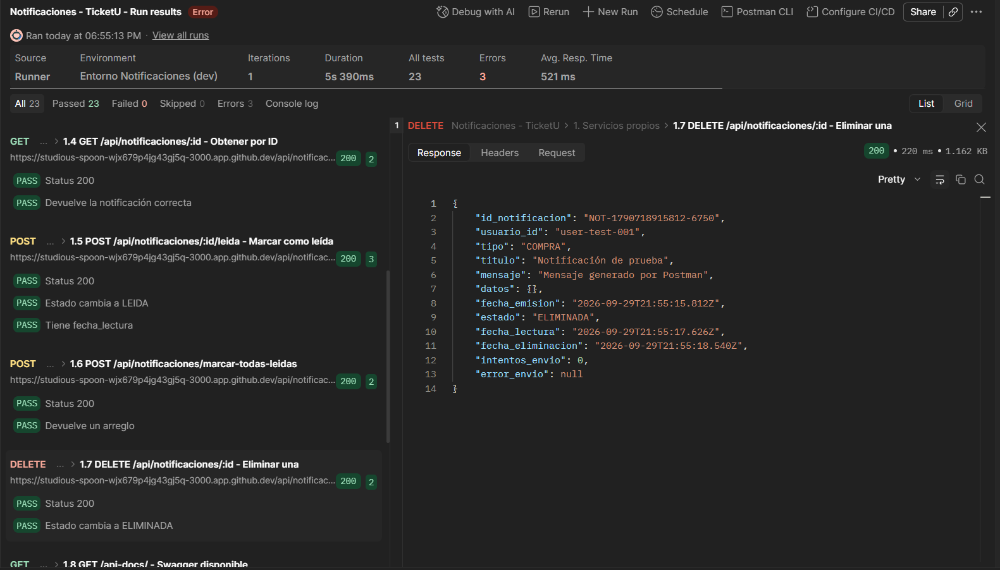

**1.8 GET /api-docs/ - Swagger disponible**
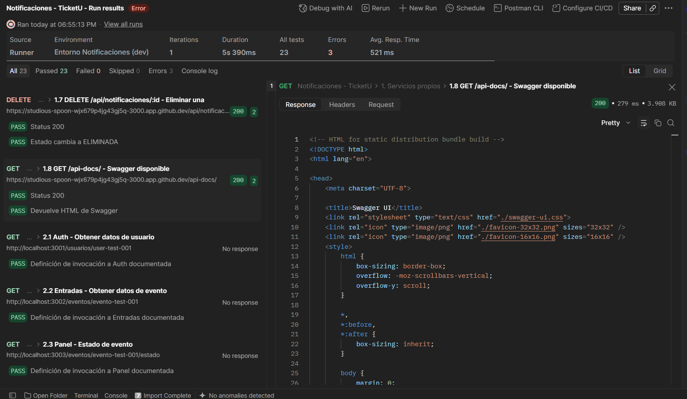

### 2. Invocaciones a otros módulos (simulados)

**2.1 Auth - Obtener datos de usuario**
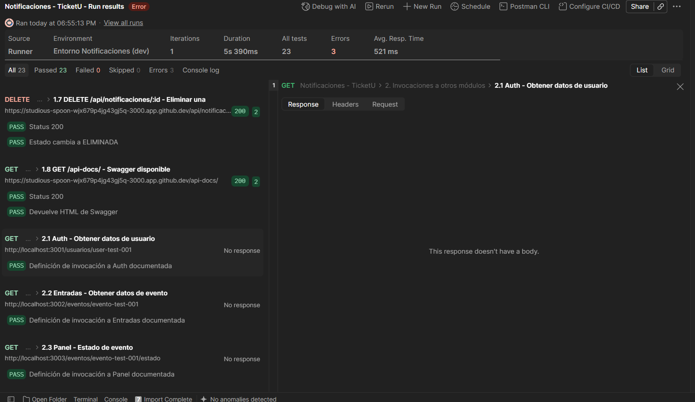

Observación: El request no se envía porque la URL apunta a `localhost:3001` (servicio de otro equipo, que por ahora no está disponible y se usa este host momentáneo).

**2.2 Entradas - Obtener datos de evento**
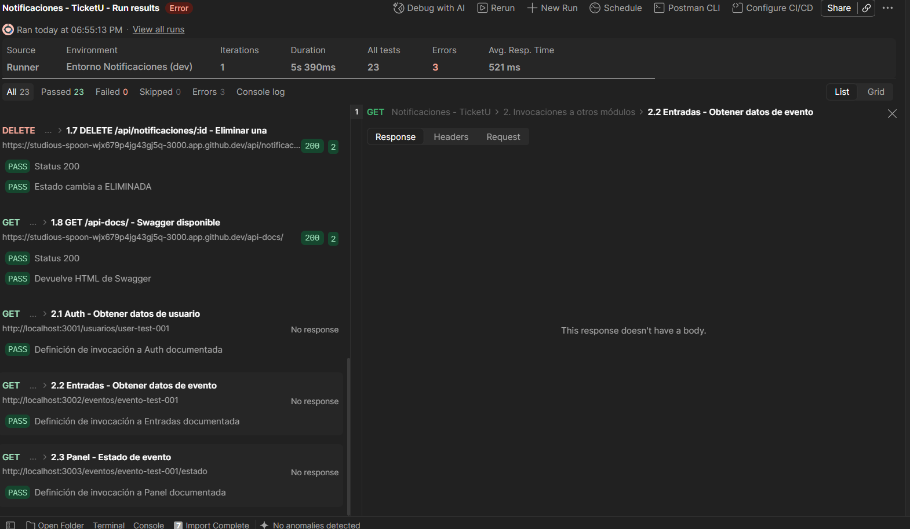

Observación: Mismo caso que 2.1. El request apunta a `localhost:3002` (no disponible).

**2.3 Panel - Estado de evento**
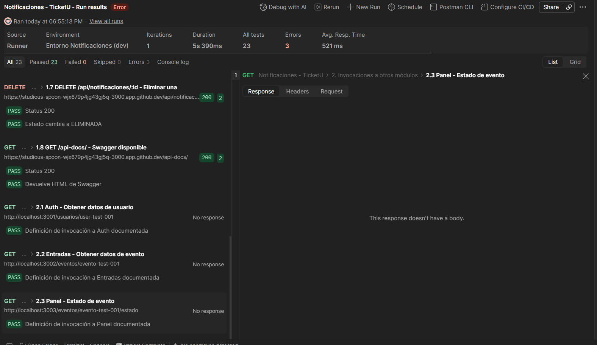

Observación: Mismo caso que 2.1. El request apunta a `localhost:3003` (no disponible).

## Distribución de tests por request

| Request | Cantidad de tests | Estado |
|---------|-------------------|--------|
| 1.1 GET /health | 3 | Pasados |
| 1.2 POST crear | 3 | Pasados |
| 1.3 GET listar | 3 | Pasados |
| 1.4 GET por ID | 2 | Pasados |
| 1.5 Post marcar leída| 3 |Pasados |
| 1.6 POST marcar todo | 2 | Pasados |
| 1.7 DELETE | 2 | Pasados |
| 1.8 GET Swagger | 2 | Pasados |
| 2.1 Auth (simulado) | 1 | Pasado |
| 2.2 Entradas (simulado) | 1 | Pasado |
| 2.3 Panel (simulado) | 1 | Pasado |
| **total** | **23** | **23 Pasados** |

